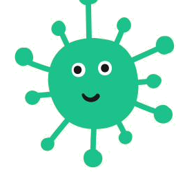

<!doctype html>
<html lang="en">
<head>
<meta charset="utf-8">
<meta name="viewport" content="width=device-width, initial-scale=1">
<title>License & reuse · Synbio Outreach Toolkit</title>
<meta name="description" content="The Genehackers synthetic biology outreach toolkit is released under CC0 (public domain) — free to use, change, translate, and rebrand, with no permission or credit required.">
<link rel="canonical" href="https://genehackers-education.github.io/license.html">
<meta property="og:title" content="License & reuse">
<meta property="og:description" content="The Genehackers synthetic biology outreach toolkit is released under CC0 (public domain) — free to use, change, translate, and rebrand, with no permission or credit required.">
<meta property="og:type" content="website">
<meta property="og:url" content="https://genehackers-education.github.io/license.html">
<meta name="twitter:card" content="summary">
<link rel="icon" type="image/png" href="assets/green_virus.png">
<link rel="stylesheet" href="style.css">
</head>
<body>
<nav id="sidebar">
  <a class="brand" href="index.html">Synbio Outreach Toolkit</a>
  

Get started
<ul class="navlist"><li><a href="index.html" class="">What this is</a></li><li><a href="how-we-run-it.html" class="">How we run it</a></li><li><a href="download.html" class="">Download everything</a></li></ul>

The lessons
<ul class="navlist"><li><a href="lessons.html" class="">All nine lessons</a></li><li><a href="lesson-1.html" class="sub">1 · Intro to synbio</a></li><li><a href="lesson-2.html" class="sub">2 · DNA double helix</a></li><li><a href="lesson-3.html" class="sub">3 · Name-in-DNA bracelets</a></li><li><a href="lesson-4.html" class="sub">4 · Strawberry DNA</a></li><li><a href="lesson-5.html" class="sub">5 · Monster genetics</a></li><li><a href="lesson-6.html" class="sub">6 · CRISPR cut-and-paste</a></li><li><a href="lesson-7.html" class="sub">7 · Engineer a glowing microbe</a></li><li><a href="lesson-8.html" class="sub">8 · Clean water</a></li><li><a href="lesson-9.html" class="sub">9 · Design challenge</a></li></ul>

Running an event
<ul class="navlist"><li><a href="materials.html" class="">Materials & cost</a></li><li><a href="safety.html" class="">Safety & tips</a></li></ul>

About
<ul class="navlist"><li><a href="about.html" class="">Who we are</a></li><li><a href="speakers.html" class="">Speaker series</a></li><li><a href="license.html" class="active">License & reuse</a></li></ul>

</nav>
<header id="topbar">
  <button class="menu-toggle" aria-label="Menu">&#9776;</button>
  

    <a href="download.html" class="btn small">&#8595; Download everything</a>
    <a href="https://github.com/genehackers-education/genehackers-education.github.io" target="_blank" rel="noopener">GitHub</a>
  

</header>

  

    

      <main class="page-main">
About
<h1>License &amp; reuse</h1>

Everything here is released under <strong>CC0 1.0</strong> &mdash; effectively the public domain.

That means you can use it, change it, translate it, print it, and put your own organization's name and logo on it, for any purpose, with no permission needed and no attribution required.

If you found it useful, a mention of <strong>UChicago Genehackers</strong> is appreciated &mdash; but it's never required, and you should feel free to make this curriculum your own.

And if you do end up running it somewhere, we'd love to know where it went &mdash; not as a condition, just because we like seeing it travel. <a href="#" class="report-link">Tell us where you used it</a>.

      </main>
      
    

  

  <footer>
    
Used these lessons in a classroom? <a href="#">Tell us where they went &rarr;</a>

    
Free to use &amp; adapt &middot; CC0 (public domain) &middot; Made by UChicago Genehackers

  </footer>

</body>
</html>
